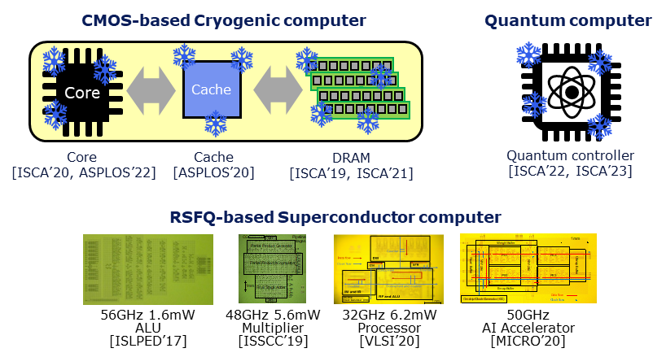

## Date & Place

| Date | Time | Place |
|:---:|:---:|:---|
| Dec 11, 2023 | 10:00 - 18:00 | [Hoam Faculty House](https://www.hoam.ac.kr/eng/)\*, Seoul Nat'l Univ., Seoul, South Korea |
| Dec 12, 2023 | 10:00 - 17:00 | Automation and Systems Research Institute\*, Seoul Nat'l Univ., Seoul, South Korea |

(\*The detailed instructions on how to arrive are provided below.)

## Agenda
### Dec 11, 2023 - Main Program
- 10:00 - 12:00 
  - __Superconductor Quantum Computing (Moonshot)__
    - Prof. Tsuyoshi Yamamoto (NEC)
    - Prof. Masamitsu Tanaka (Nagoya University)
    - Prof. Koji Inoue (Kyushu University)

- 12:00 - 13:00 
  - __Lunch__

- 13:00 - 14:00 
  - __Superconductor Classical Computing__
    - Pratiksha Mundhe (Kyushu University)

- 14:00 - 15:00 
  - __A Fault-Tolerant Million Qubit-Scale Distributed Quantum Computer__
    - Junpyo Kim (Seoul National University)

- 15:00 - 16:00 
  - __SuperCore: An Ultra-Fast and Energy-Efficient Processor Architecture Using SFQ Logic Devices__
    - Junhyuk Choi (Seoul National University)

- 16:00 - 16:30 
  - __Break__

- 16:30 - 18:00 
  - __Next-Generation Server Architecture Using Data Processing Unit__
    - Prof. Jangwoo Kim (Seoul National University)

- 18:00 - 20:00 
  - __Dinner__

### Dec 12, 2023 - Research Discussion
- 10:00 - 12:00 
  - __Superconductor Quantum Computing (Error collection and system architecture exploration)__
  
- 12:00 - 13:00 
  - __Lunch__

- 13:00 - 14:30 
  - __Superconductor Classical Computing (Timing-error-tolerant accelerator design)__

- 14:30 - 15:00 
  - __Break__

- 15:00 - 16:30 
  - __Superconductor Computing (General purpose: microarchitecture)__

- 16:30 - 17:00 
  - __Discussion for accelerating our collaboration__

## Way to visit

### Hoam Faculty House (Dec 11, 2023)

<iframe width="720" height="400" frameborder="0" scrolling="no" marginheight="0" marginwidth="0" id="gmap_canvas1" src="https://maps.google.com/maps?width=520&amp;height=400&amp;hl=en&amp;q=Hoam%20Faculty%20House%20Gwanak-gu+(Hoam%20Faculty%20House)&amp;t=&amp;z=13&amp;ie=UTF8&amp;iwloc=B&amp;output=embed"></iframe>  

### Automation Systems and Research Institute (Dec 12, 2023)

<iframe width="720" height="400" frameborder="0" scrolling="no" marginheight="0" marginwidth="0" id="gmap_canvas2" src="https://maps.google.com/maps?width=520&amp;height=400&amp;hl=en&amp;q=%EC%9E%90%EB%8F%99%ED%99%94%EC%8B%9C%EC%8A%A4%ED%85%9C%EA%B3%B5%EB%8F%99%EC%97%B0%EA%B5%AC%EC%86%8C%20Gwanak-gu+(Automation%20and%20Systms%20Research%20Institute)&amp;t=&amp;z=13&amp;ie=UTF8&amp;iwloc=B&amp;output=embed"></iframe>  

## Contacts

| Name | Mail | Phone |
|:---:|:---:|:---:|
| Ilkwon Byun (변일권) | ik.byun@snu.ac.kr | +82 10-8302-1994 |
| Jungmin Cho (조정민) | jungmin.cho@snu.ac.kr | +82 10-9350-2573 |